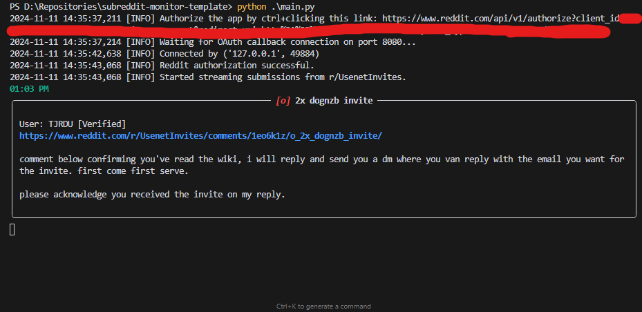

# Reddit App

A terminal-based python script that allows you to monitor a subreddit for new posts containing specific keywords. Runs off of your own Reddit account and reddit-hosted developer application (see setup instructions below for more information).



## Table of Contents

- [Features](#features)
- [Prerequisites](#prerequisites)
- [Setup](#setup)
  - [1. Create a Reddit Authorized Application](#1-create-a-reddit-authorized-application)
  - [2. Configure the `.env` File](#2-configure-the-env-file)
  - [3. Set Up the `config.json` File](#3-set-up-the-configjson-file)
- [Installation](#installation)
- [Usage](#usage)
- [Contributing](#contributing)
- [License](#license)

## Features

- **Feature 1:** Real-time monitoring of new subreddit posts.
- **Feature 2:** Keyword filtering of post titles and bodies.
- **Feature 3:** Customizable notification beeps.
- Add more features as needed.

## Prerequisites

Before you begin, ensure you have met the following requirements:

- You have a [Reddit](https://www.reddit.com/) account.
- You have installed [Python](https://www.python.org/) (v3.10 or higher).
- You have access to a terminal or command prompt.

## Setup

### 1. Create a Reddit Authorized Application

To interact with Reddit's API, you need to create an authorized application.

1. **Navigate to Reddit App Preferences:**
   Go to [https://www.reddit.com/prefs/apps/](https://www.reddit.com/prefs/apps/).

2. **Create a New Application:**
   - Click on the **"are you a developer? create an app..."** button.
   
3. **Fill in the Application Details:**
   - **Name:** Choose a name for your application.
   - **App Type:** Select **"script"**, as this program is a script.
   - **Description:** (Optional) Provide a brief description of your application.
   - **Redirect URI:** For most scripts, you can use `http://localhost:8080`. The port number can be changed, but it must match the port number in your `.env` file and not be used by any other applications.
   
4. **Save the Application:**
   - Click **"Create app"** to save your application.

5. **Retrieve Credentials:**
   - After creation, you'll see your **Client ID** under the app name and the **Client Secret** next to "secret". Place these in your `.env` file.

### 2. Configure the `.env` File

The `.env` file stores your environment variables securely.

1. **Create a `.env` File:**
   In the root directory of your project, create a file named `.env`.

2. **Add the Following Variables:**

   ```env
   REDDIT_CLIENT_ID=your_client_id
   REDDIT_CLIENT_SECRET=your_client_secret
   REDDIT_USERNAME=your_reddit_username
   REDDIT_PASSWORD=your_reddit_password
   REDDIT_USER_AGENT=your_user_agent
   ```

   - **REDDIT_CLIENT_ID:** Your Reddit application's Client ID.
   - **REDDIT_CLIENT_SECRET:** Your Reddit application's Client Secret.
   - **REDDIT_USERNAME:** Your Reddit username.
   - **REDDIT_PASSWORD:** Your Reddit password.
   - **REDDIT_USER_AGENT:** A unique identifier for your application (e.g., `MyRedditApp/1.0 by /u/YourUsername`).

### 3. Set Up the `config.json` File

The `config.json` file contains configuration settings for the application.

1. **Create a `config.json` File:**
   In the root directory of this repository, copy and paste the `sample_config.json` file into a new file, that you should rename to `config.json`. Follow the instructions below to adjust the settings as needed.

2. **Add Configuration Settings:**

   ```json
   {
     "subreddit": "YourTargetSubreddit", // Do not include the r/ prefix
     "keywords": ["keyword1", "keyword2"], // A list of keywords you want highlighted in the post title or body
     "beep_all_posts": true, // true or false - whether or not to beep when a new submission is found
     "beep": {
        "enabled": true, // true or false - whether or not to beep when a new submission is found
        "frequency": 1440, // frequency of the beep in Hz
        "duration": 100 // duration of the beep in milliseconds
     },
     "color_flairs": true, // true or false - whether or not to color flair text (for trading subreddits)
     "logging_level": "INFO", // INFO, DEBUG, ERROR, etc. - what level of logging to use
     "skip_existing": false, // true or false - whether or not to skip existing submissions
     "title_filter": "[Selling]" // a string to filter the title of the submission (leave blank for no filter) (useful for filtering out selling/buying posts based on preferences)
   }
   ```

   - **subreddit:** The subreddit the application will interact with.
   - **keywords:** List of keywords to filter content.
   - **beep:** Settings for the notification beep.
   - **color_flairs:** Whether to color flair text.
   - **logging_level:** The level of logging to use.
   - **skip_existing:** Whether to skip existing submissions.
   - **title_filter:** A string to filter the title of the submission (leave blank for no filter) (useful for filtering out selling/buying posts based on preferences).

   *Adjust the settings based on your application's requirements.*

## Installation

1. **Clone the Repository:**

   ```bash
   git clone https://github.com/chanzer0/subreddit-monitor-template.git
   ```

2. **Navigate to the Project Directory:**

   ```bash
   cd subreddit-monitor-template
   ```

3. **Install Dependencies:**

   ```bash
   pip install -r requirements.txt
   ```

   *If your project uses a different package manager or has specific installation steps, adjust accordingly.*

## Usage

1. **Start the Application:**

   ```bash
   python main.py
   ```

2. **Interact with the Application:**
   
   - Ensure your `.env` and `config.json` files are correctly configured.
   - When the app starts, you will be prompted to navigate to the URL provided in the console. This is necessary to authorize the application and provide a redirect URI for incoming submissions.
   - Once you have authorized the application, you can close the browser window and the application will continue to run in the terminal.

3. **Monitor Logs:**
   
   - New submissions will be highlighted in the terminal with the keywords you specified. If you have the beep enabled, you will also hear a beep.

## Contributing

Contributions are welcome! Please follow these steps:

1. **Fork the Repository.**
2. **Create a New Branch:**

   ```bash
   git checkout -b feature/YourFeature
   ```

3. **Commit Your Changes:**

   ```bash
   git commit -m "Add your message"
   ```

4. **Push to the Branch:**

   ```bash
   git push origin feature/YourFeature
   ```

5. **Open a Pull Request.**

Please ensure your code adheres to the project's coding standards and includes appropriate tests.

## License

This project is licensed under the [MIT License](https://opensource.org/license/mit).
